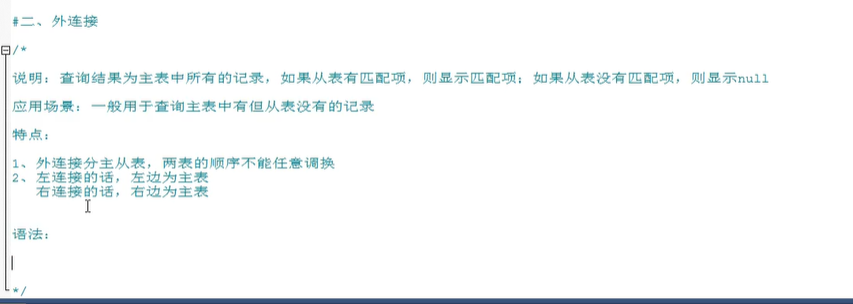

**1.使用Concat拼接字符，  将查询的结果拼接。**

**只查询first_name的结果如下：**

select first_name from employees;


**查询 last_name 这一类的结果：**

select  last_name from  employees


通过concat将结果拼接：

select CONCAT(first_name,last_name) as '完整姓名' from  employees


字符函数：


**2.SubString函数 ** 截取字符

SubString（从哪个位置开始，截取长度）；   mysql中默认开始索引是1


**3. INSTR  获取字符第一次出现的索引**


**4.TRIM  取出前后指定的字符， 默认 是 去除 前后空格**


**5.填充字符    设置固定字符长度， 然后开始填充**


**6.STRCMP 比较两个字符大小**


**7.截取子串  LEFT/RIGHT**  


**8. 内连接：  连接条件与筛选条件的写法**

与普通的连接，查询结果一样 只是阅读性较好。


**9.外连接：**


**可以查出A表有B表没有的**


**用法：**




**它会保证左边的表的所有记录都查出来，同时右边的表有对应的也查出来，没有对应的也会查出来，只不过值显示为null**

也就是A表的记录有17条，那么外连接查出来的数据也会有17条。

```mysql
#分组函数 以及 视图    统计每个部分的平均工资 并创建一个视图

create view t as  SELECT job_id,avg(salary) from employees GROUP BY job_id;

select * from t;

drop view t;
```


```mysql
CREATE TABLE t1 (
id int(9) NOT NULL auto_increment, 
username varchar(25) ,
update_time timestamp default CURRENT_TIMESTAMP on update CURRENT_TIMESTAMP,PRIMARY KEY (id));
```

