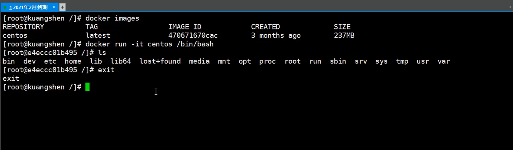

**exit 退出镜像**




**容器的退出**


**docker安装mysql: **                     （映射时主机不存在对应目录或文件不要紧，docker会自动创建。）


`````cmd
docker run -p 3306:3306 --name mysql -v /home/lww/docker/mysql/conf:/etc/mysql/conf.d  
-v /home/lww/docker/mysql/logs:/logs 
-v /home/lww/docker/mysql/data:/var/lib/mysql 
-e MYSQL_ROOT_PASSWORD=123456 
-d mysql:5.7
`````


**docker里面的mysql，数据库导出为sql文件  放到主机目录:**


`````cmd
docker exec 78194affc22f sh -c ' exec mysqldump -- all-databases -uroot -p"123456" '  >  /home/lww/all-databases.sql
`````


