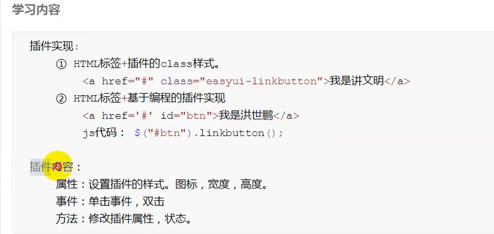
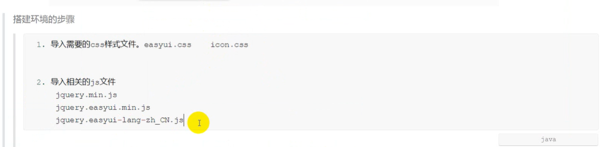
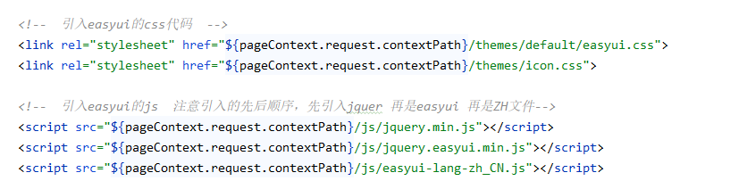
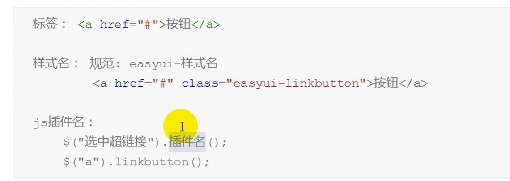
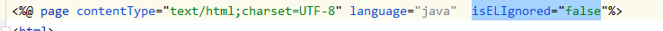
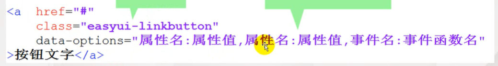
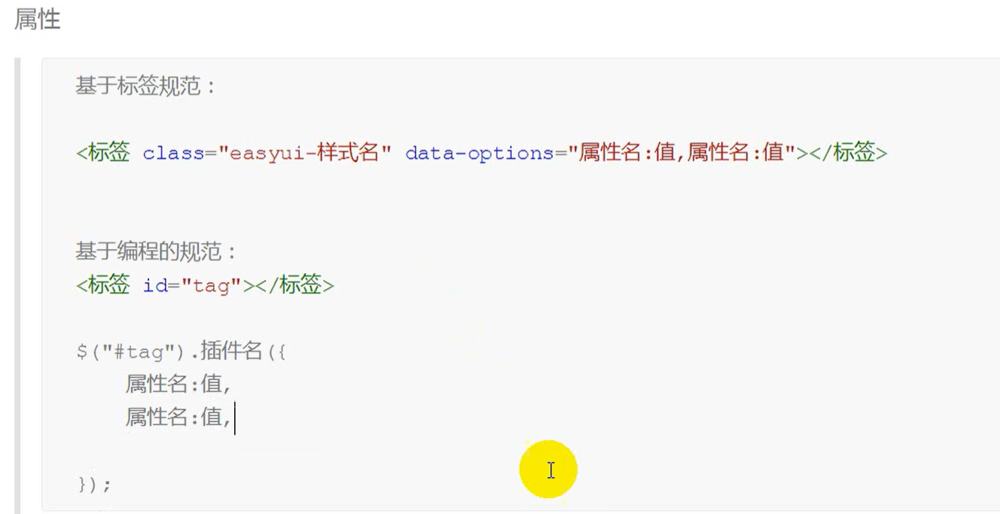
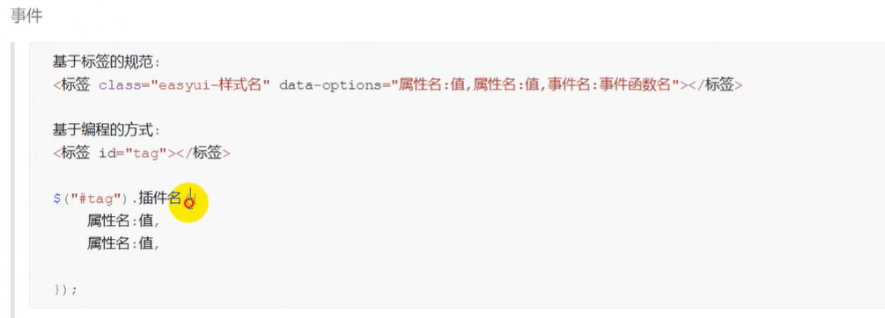
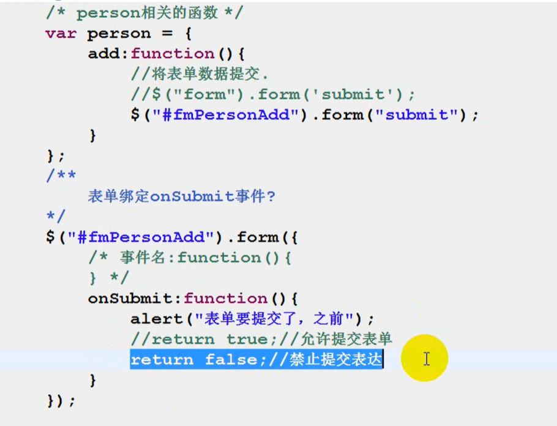

**easyui实现方式：**

1.通过添加样式实现   2.通过抓取元素js代码执行绑定实现。

**2.easyui的使用**

导入css文件:  直接把里面的themes文件夹粘贴到web项目中的根目录下

导入js文件，创建个js文件夹，将jquery.min.js和jquery.easyui.min.js和easyui--zh_CN.js三个文件放进去。

2.在网页或jsp中的引用：

如果css和JS文件没有正确加载，可能是jsp默认关闭了EL表达式的取值，要在头标签中打开。

