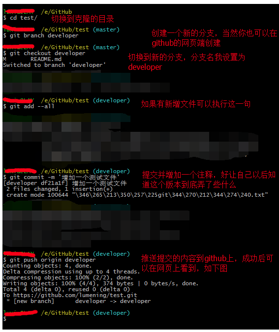
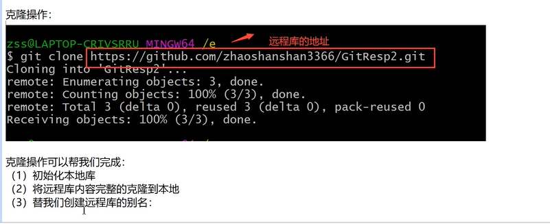
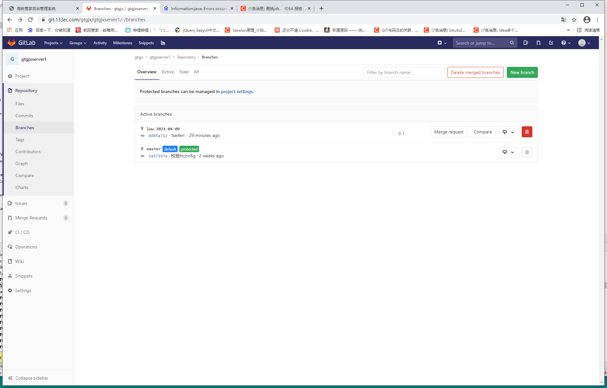
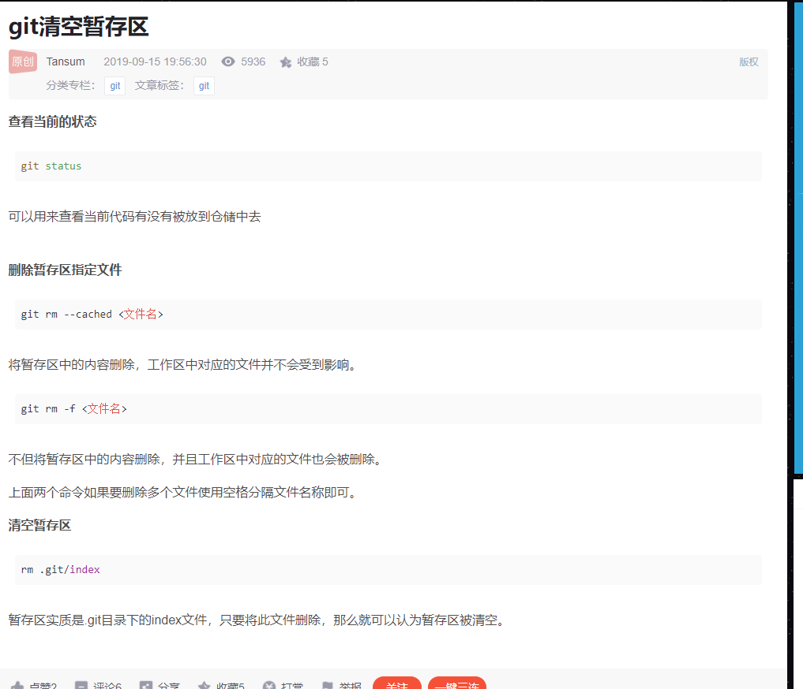
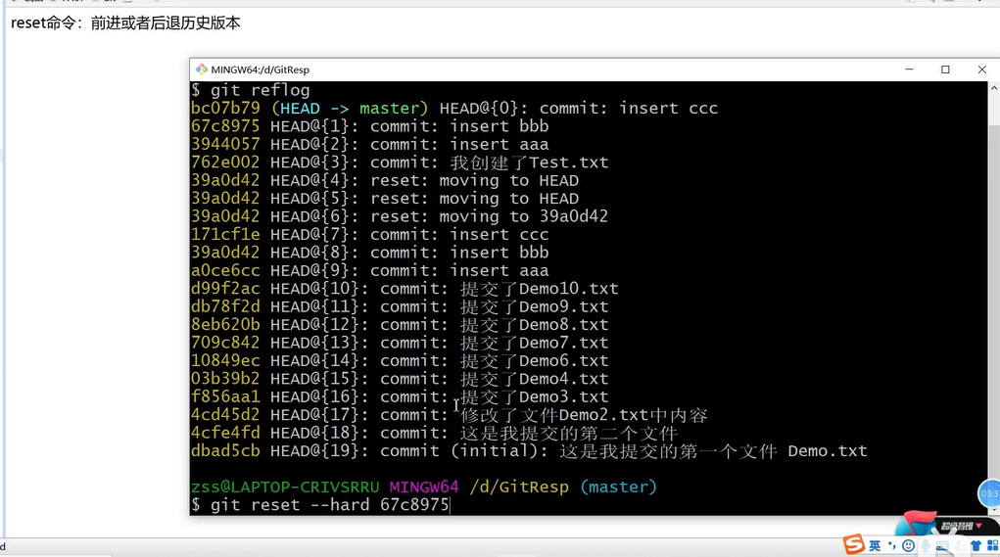
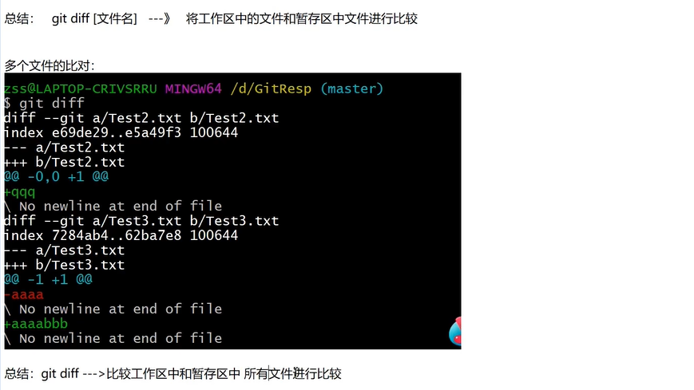
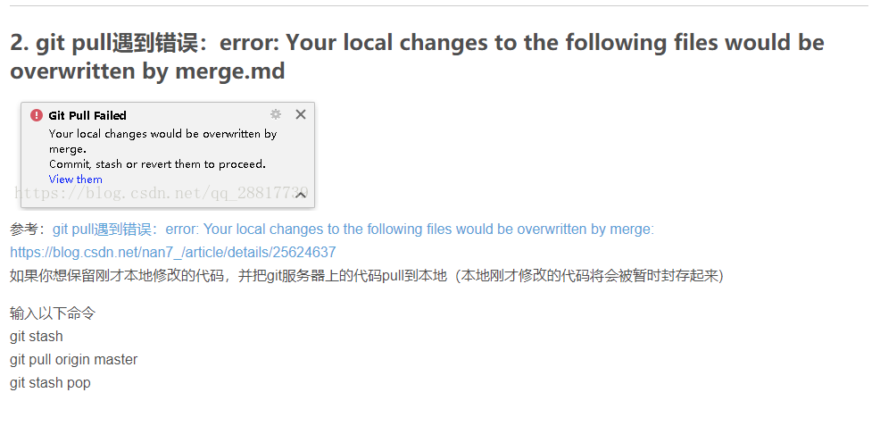

*** Please tell me who you are.

Run

  git config --global user.email "you@example.com"
  git config --global user.name "Your Name"

to set your account's default identity.
Omit --global to set the identity only in this repository.


**项目初始化:**      将一个项目初始化为一个git可用的格式项目

git init

将本次项目与仓库进行关联

https://github.com/sandwichfe/learn_easyui.git

git remote add origin https://github.com/sandwichfe/learn_easyui.git

```shell
$ git remote add origin https://github.com/user/repo.git
# Set a new remote
```

查看当前所在 远程仓库  $ git remote -v

**创建一个新的分支：**

git  branch  分支名

**切换分支：**

git checkout  分支名


**提交:**

git add .

git commit -m "备注提交内容"

**推送到分支**

git push  origin 分支名：这种写法，默认只推送当前分支,当前分支也是唯一分支。

 完整命令格式：git push <远程主机名> <本地分支名>  <远程分支名>。

```
git push  origin master
```

8. **git pull**：
9. 拉取远程主机某个分支的更新，再与本地的指定分支合并。相当于是从远程获取最新版本并merge到本地。
    完整命令格式：git pull <远程主机名> <远程分支名>:<本地分支名>
    格式对应示例：git pull origin next:master
   远程主机名—origin；远程分支名—next；本地分支名—master。


​	

​	git branch -a命令来查看所有的分支。

假设要删除new-a的远程分支，我们需要先把分支切换到master，因为你现在所在的分支就是new_a，在这个分支下，是不能删除它的。

使用命令 git checkout master

删除

 git push origin --delete new_a


本地git init之后还是master分支

git add *
git commit -m '修改文件'
git remote add 远程git地址
git push origin master
查看github的仓库地址，是推送到了master分支
需要合并到main分支

git fetch origin
git checkout main
git merge master --allow-unrelated-histories（合并分支解决冲突）

直接合并分支，显示
fatal:refusing to merge unrelated histories
git add *
git commit -m '合并分支'
git push
————————————————
版权声明：本文为CSDN博主「caicsama」的原创文章，遵循CC 4.0 BY-SA版权协议，转载请附上原文出处链接及本声明。
原文链接：https://blog.csdn.net/caicsama/article/details/112586274











#### 


#### **git reset命令：**




#### **git diff     比较当前工作区和暂存区的文件内容差异**   

工作区：  当前工作的目录。

暂存区： git add 后的文件就放入了git 的暂存区。

本地库： git commit 后 ，内容就从暂存区提交到了本地库。




### **合并分支**

将分支newtest 合并到当前所处的分支

````git
git merge newtest
````


pull 时或者时合并分支时，遇到这种情况；    

````
git stash
pull  或者  merge操作   （根据你当前的操作所对应）
git stash pop   
````




