**Javaweb项目的标准结构：**

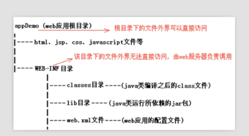

**2.Http信息，发送请求时与接受响应的情况。**

例如当请求第二个文件  css文件时

左边为浏览器发送请求时的请求内容，右边为响应的内容。

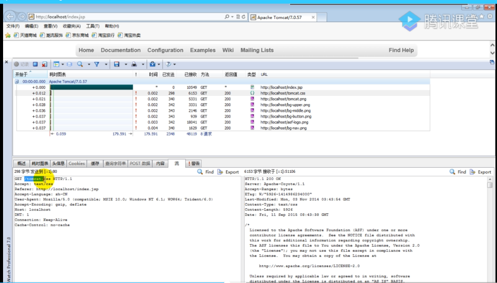

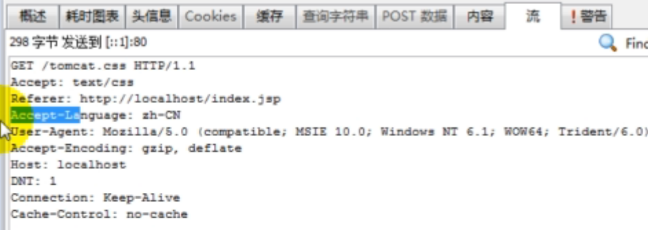

**3.Get与Post**

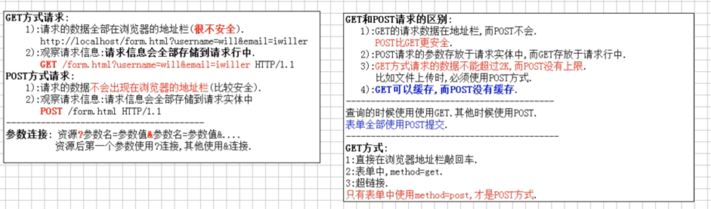

**4：Servlet**

使用Servlet必须要继承Servlet接口才是真正的Servlet，然后里面的service方法是主要的业务方法，

Servlet的路径映射配置：         配置一个HelloServlet

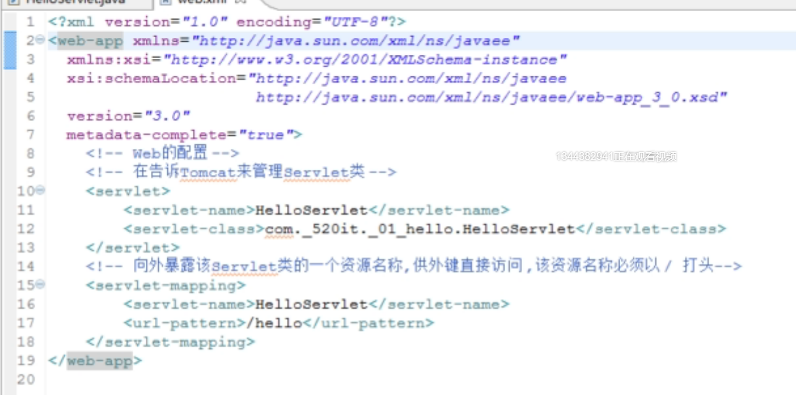

**4.1 servlet的声明周期**

**servlet中的一些方法说明**

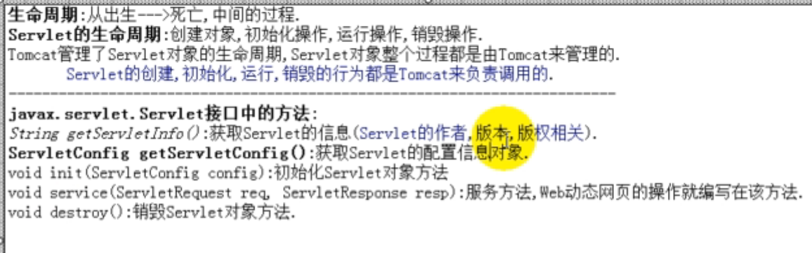

**生命周期:**

Servlet为单例的，当第一次请求的时候，会执行此servlet的构造方法，然后是继承下来的init方法，

->   service方法  ->   destroy 方法。   

第二次请求时，就不会再去创建servlet对象了，而是使用刚刚第一次的对象，然后只执行里面的service的方法，后面每次执行都只执行service方法，直到tomcat容器关闭，执行destroy方法结束。

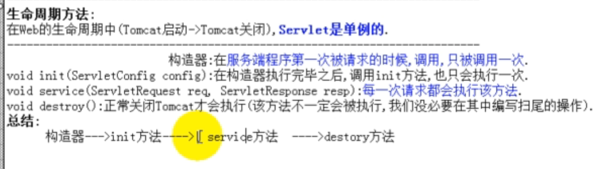

**servlet的对象被容器创建时**：     采用了Class.newInstance方法

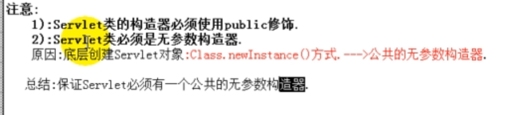

**Servlet的请求流程：**

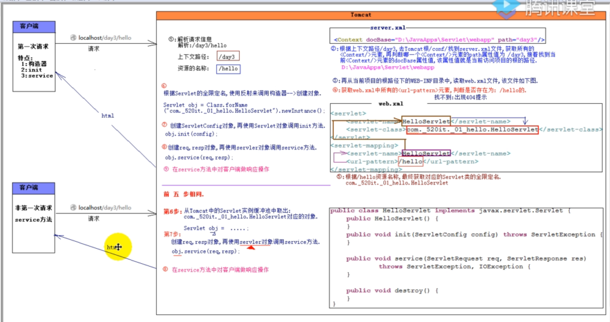

**Servlet的继承体系：**

javax.servlet->GeneServlet-> HttpServlet

javax.servlet是最基本的servlet，他有基础的init  service     destroty  getServletConfig方法等，

而每次用都要写一些重复的方法，很不好，于是GeneServlet继承了他，让每一个继承他的servlet都有了这些方法，以及方便的得到ServletConfig对象，最后是HttpServlet，他里面有着写专门关于Http的一些处理，他又继承了GeneServlet，  所以最后使用servlet只需要继承HttpServlet即可。

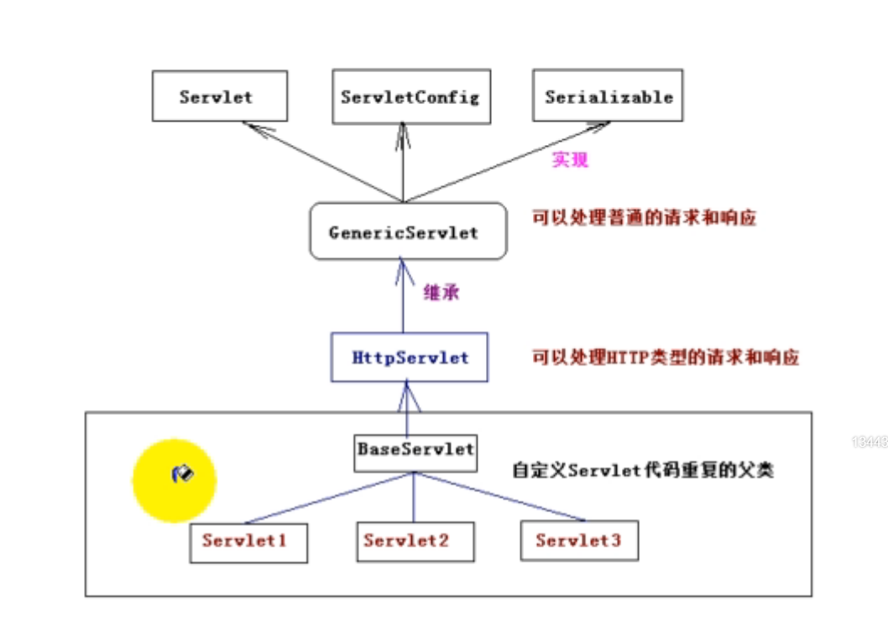

**HttpServletRequest常用方法：**

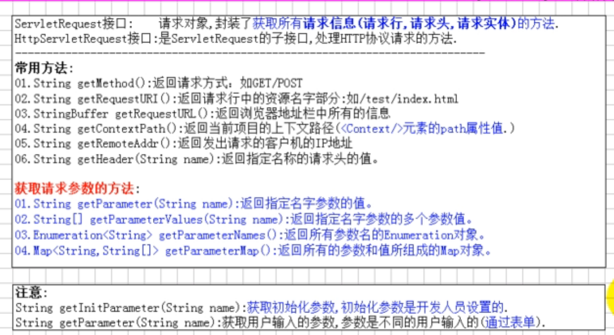

**tomcat乱码问题：**

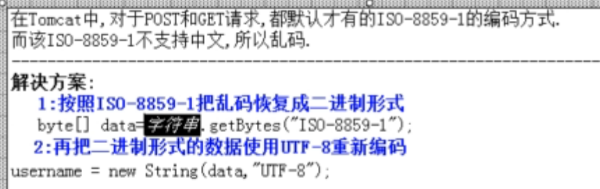

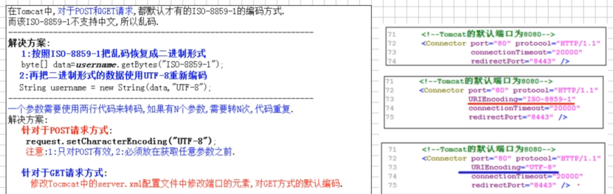

**servlet线程不安全问题**

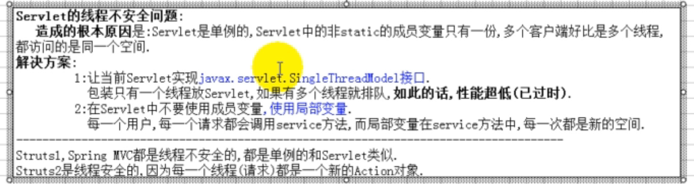

**Cookie**

**Cookie是保存在浏览器客户端**

有会话Cookie和持久化Cookie， 会话Cookie当窗口关闭时就失效了，持久化Cookie则可以设置有效时间。

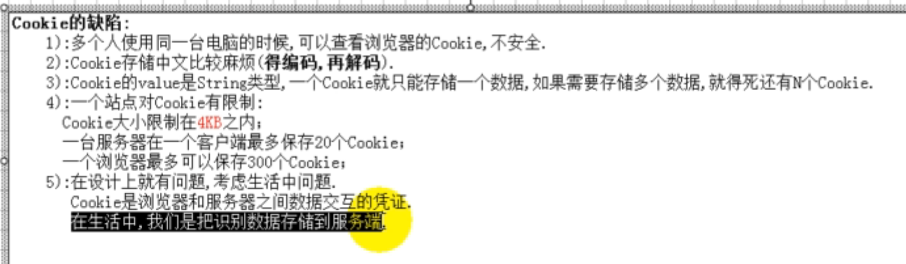

**Session：**

**Session是保存在服务端**      当浏览器窗口关闭时就会失效，因为当要取用session时，有一个session id   要依赖浏览器以一个会话cookie的方式存放，来进行cookie取得校验，当浏览器关闭时，次会话cookie也没有了，从而session也失效了。

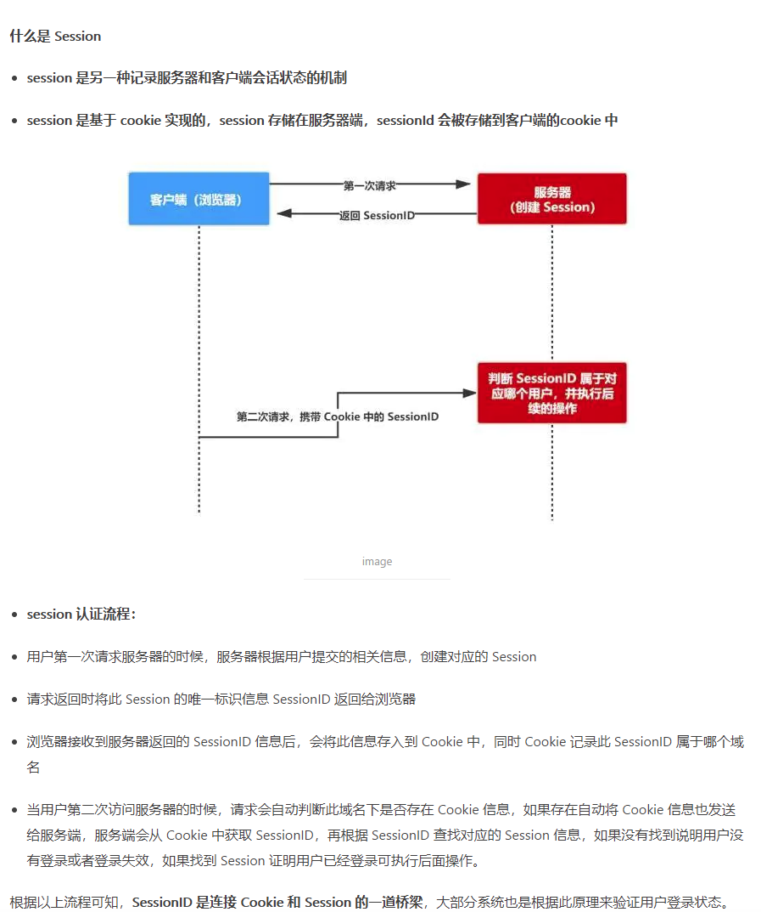

**5.Jsp**

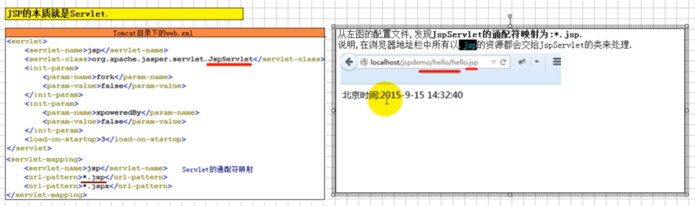

**6.Jsp九大内置对象，无需声明就可以在其中使用的对象。**

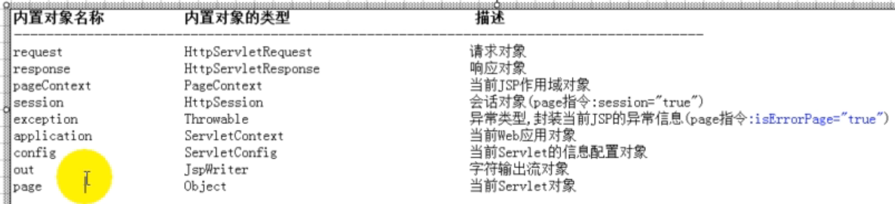

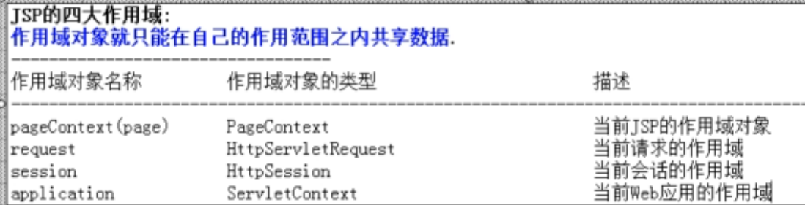

**EL表达式**

用于方便快捷获取值;

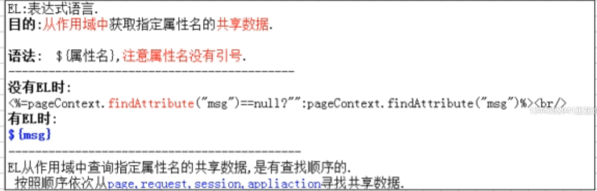

**JSTL**

使用JSTL的话要添加相关jar包，并且在jsp文件开头要引用一下。

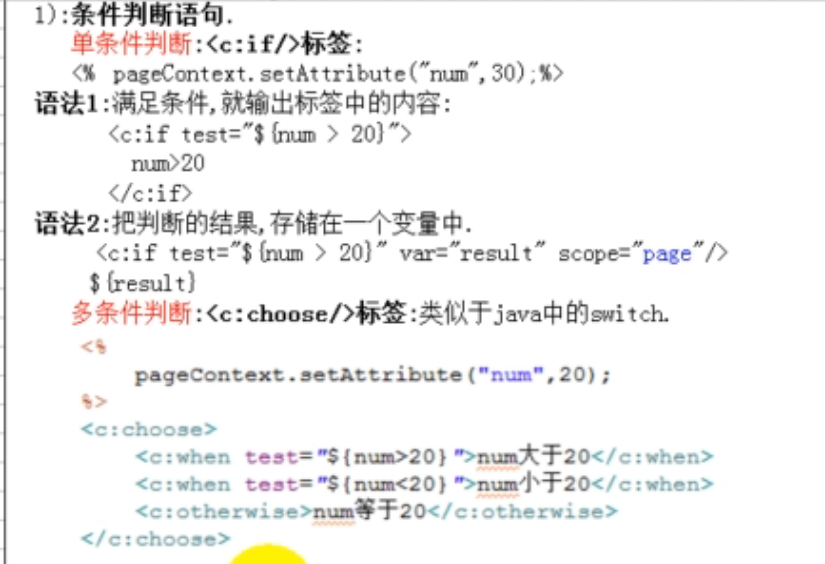