**struts执行流程：**

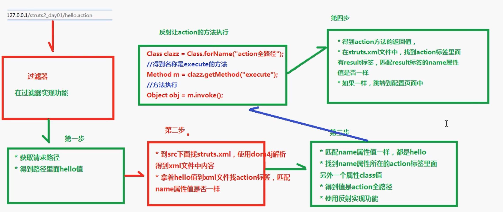

### ***\*使用action标签method属性\****

1 **创建action，创建多个方法*\*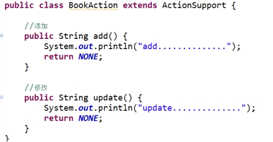\**** 2 使用method配置***\*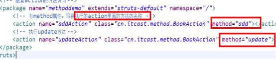\***

******* 缺陷：action每个方法都需要配置，如果action里面有多个方法，配置很多的action

**使用通配符实现（重点）**

1 在action标签里面name属性，name属性值里面写 符号 *  星号

1）* 理解： 表示匹配任意内容

\- 比如访问hello，* 可以匹配到

\- 比如访问add，* 可以匹配到

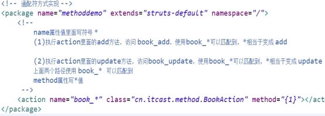 

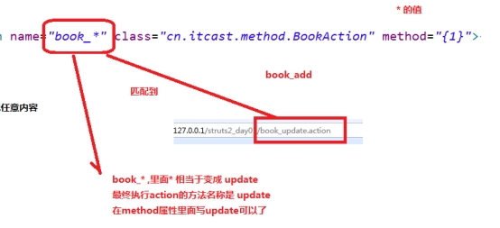

**全局result  公用result**

当有好几个action都需要返回同一个result路径跳转时，就可以使用全局result，有返回值的action就会默认去到全局result里面去找。

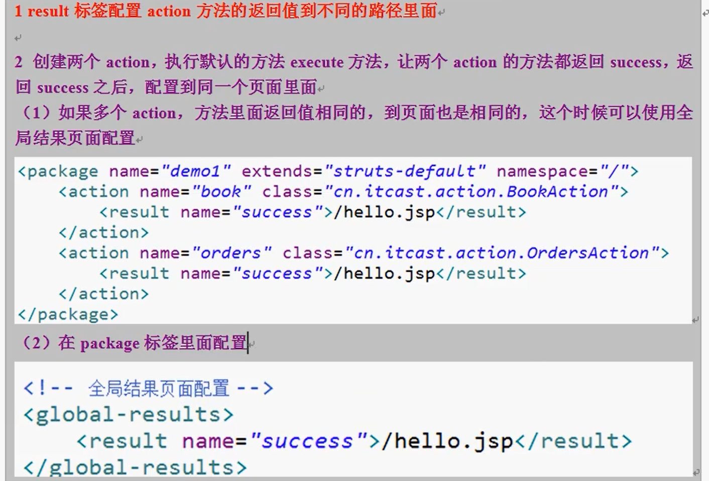

写在action里面的result，成为局部result，action优先寻找局部的result，没有再去全局global_result里面去找。

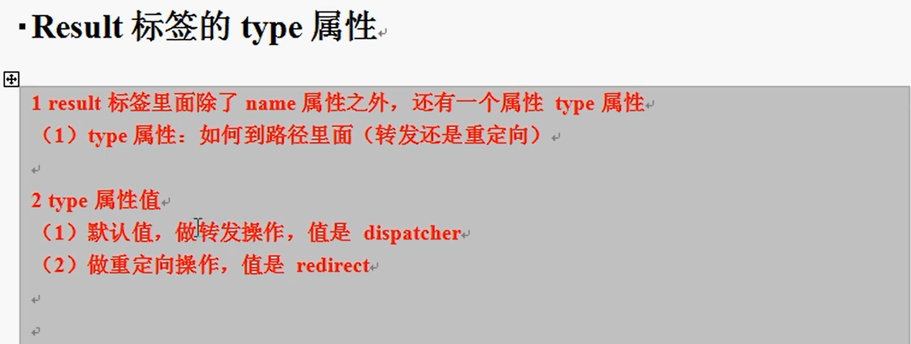

struts讲数据自动封装到对象

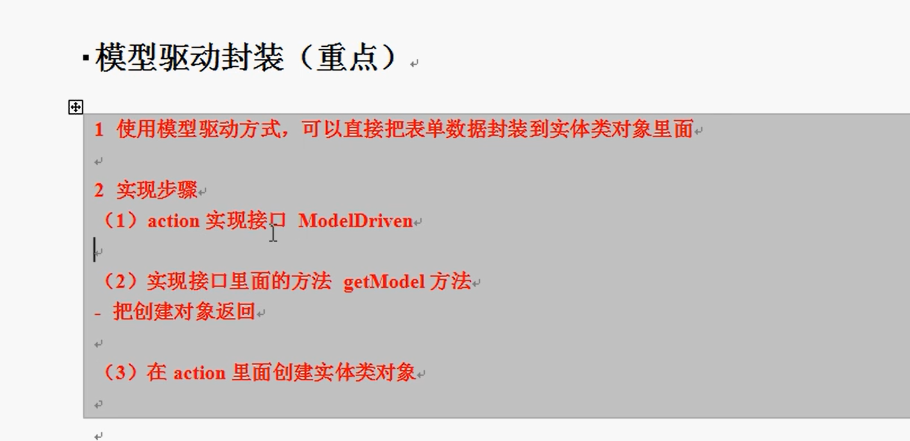

**值栈以及servlet和action的区别**

servlet为单例 而  action是多例的。

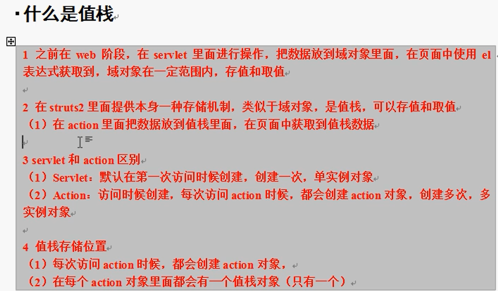

**值栈中的两个区域： 左边为root 常用区域  右边为context区域**

**当在jsp中用ognl来取值时，去root中的值直接取出即可，而去context中的值需要前面加个#**

**号表明要取context中的值。**

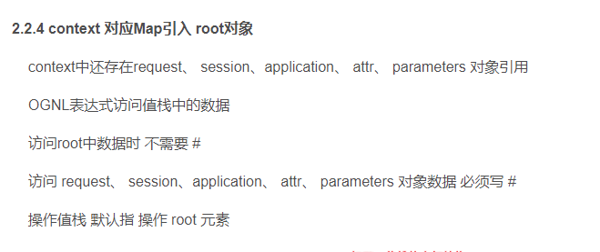

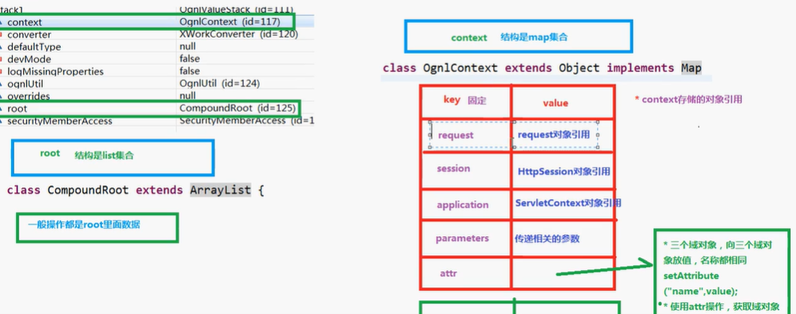

**通过ognl获取值栈中context区域的request对象中的值**

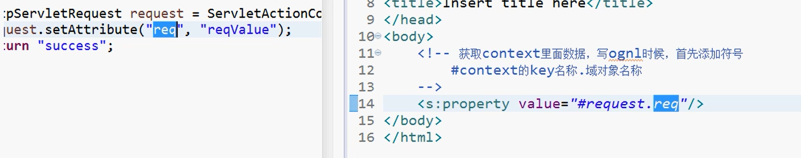

**取Model中的值 直接取即可  **

**ognl中的%的使用， 当在struts自带的标签中又需要使用ognl表达式时 就需要加一个%。**

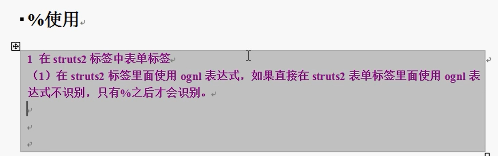

**这样取值**

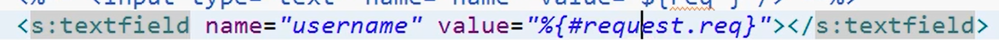

**过滤器和拦截器的区别**

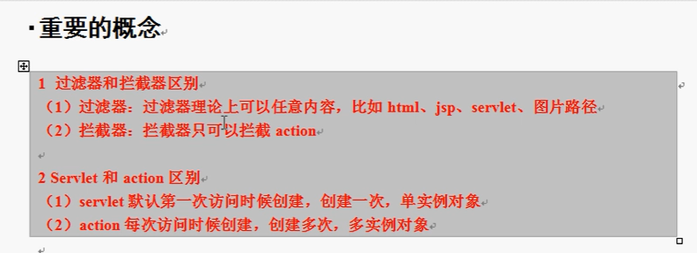

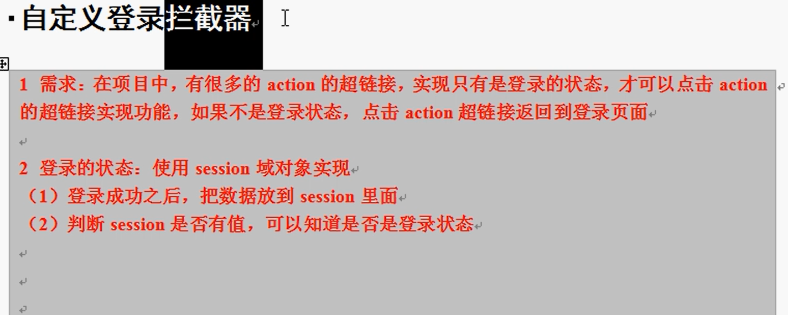

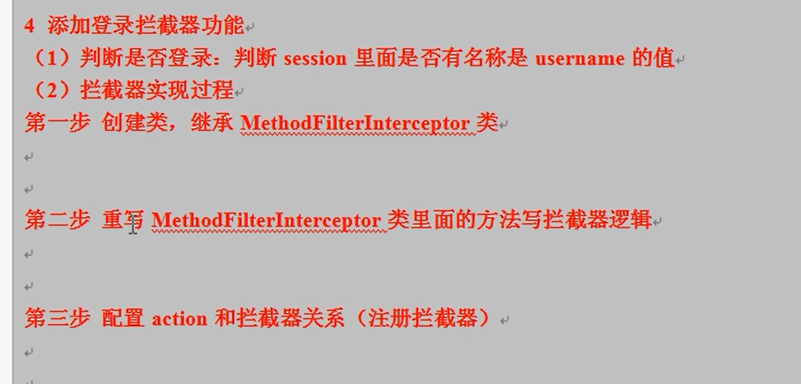

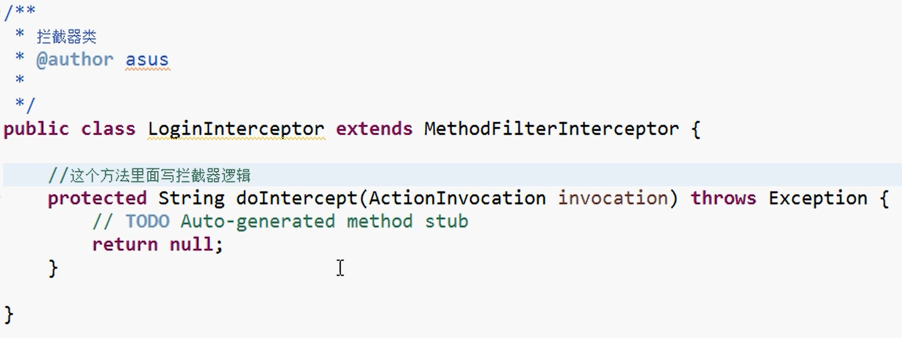

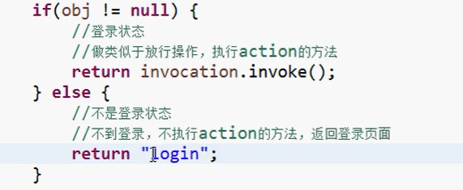

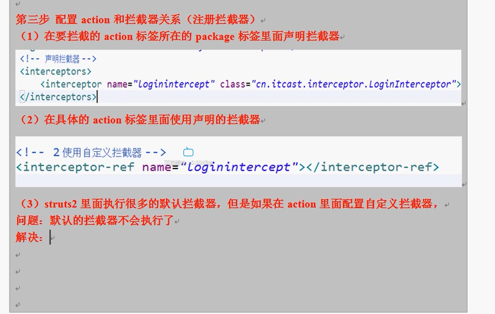

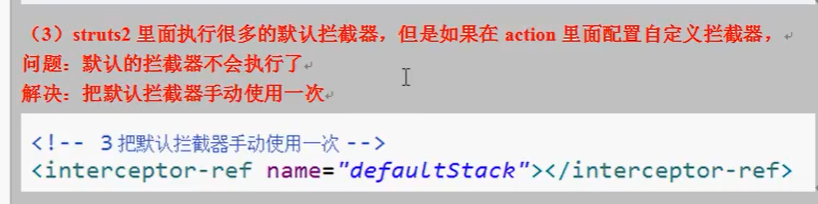

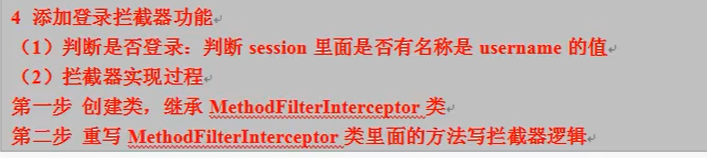

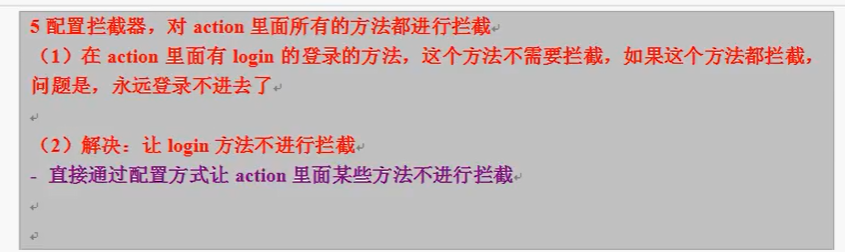

设置返回json格式的数据：

记得要有json_plugins的依赖包

首先在action中：

**定义需要返回为Json的对象或者List，**

**然后给他们设置Getter方法**

如果有的字段也写上了Getter方法，但是并不希望返回它，就可以打下面那个注解忽略它。

否则action会把所有在此action中定义了getXXX方法的XXX字段都作为json返回。

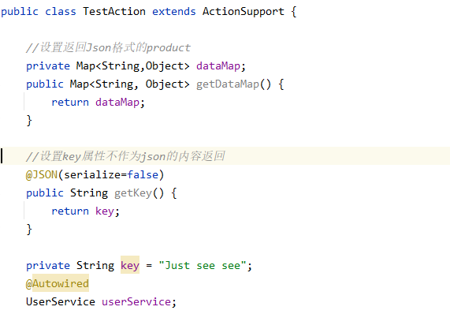

在Struts在xml配置中：

**在上面的package里面的继承一定要继承json-default**

然后就是result里面不写name，只定义type=‘json’，最后在里面的param标签

定义name，以及在action需要输出的变量名即可。

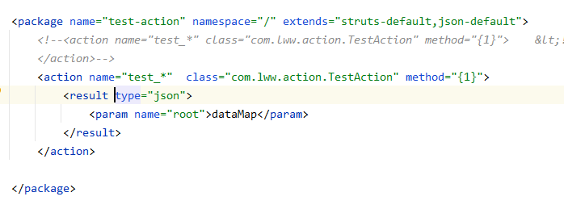

文件上传：

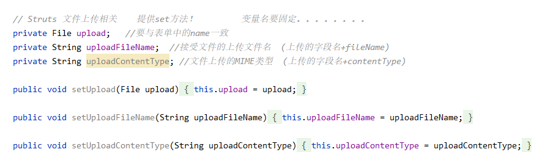

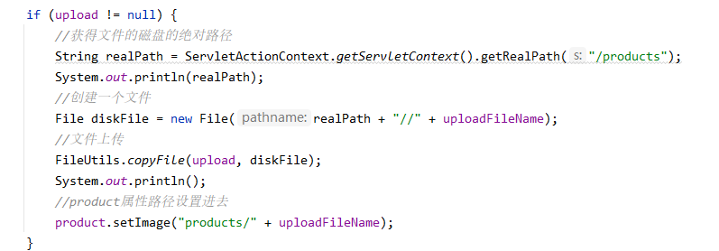

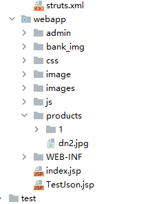

