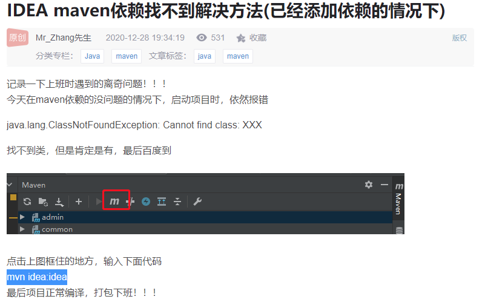
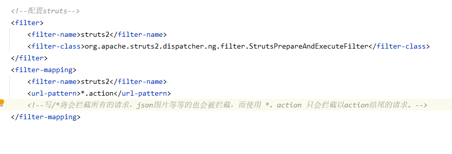
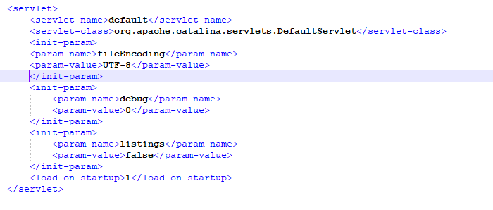
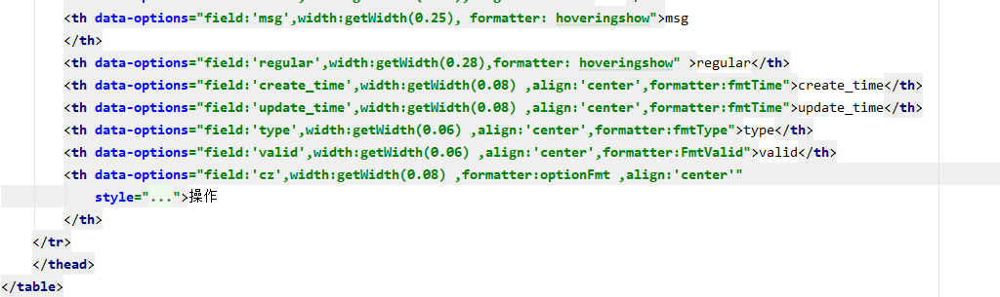

1.不要用tomcat10，运行起来有一个javax的依赖不兼容问题。

2.太久没用spring文件了，配置里面的contex和aop时，记得最上面加上命名空间。





**配置拦截  /*     与*.action**




项目源文件没乱码，但是发布到tomcat之后，乱码的问题，在tomcat，web.xml中加上，

```xml
<init-param> 
		<param-name>fileEncoding</param-name> 
		<param-value>UTF-8</param-value> 
		</init-param>
<init-param>
```



清除一下浏览器缓存，重新加载页面。


ajax    jquery    保存返回的值并返回函数。

```js
function getById(id) {
    var coordinates = (function() {
        var result;
        $.ajax({
            type:'POST',
            url:"${pageContext.request.contextPath}/theme/getTheme.action?id=" + id,
            async:false,
            success:function(data){
                result = data;
            }
        });
        return result;
    })();
    return coordinates.rows
    console.log(coordinates);
}
```

ajax get请求 返回值获取不到的问题：

```js
   function deleteById(id) {
        var coordinates = (function () {
            var result;
            $.ajax({
                type: 'get',
                url: "${pageContext.request.contextPath}/theme/removeMsgCode.action?id=" + id,
                 //这玩意居然得写出来  不然得到返回值会有问题 应该与是get请求有关
                async: false,                          
                success: function (data) {
                    result = data;
                }
            });
            return result;
        })();
        return coordinates
        console.log(coordinates);
    }
```


easyui显示文字超出内容：

1.在table datagrid里面：




加上了一个formatter：

然后 formatter对应的函数如下：

```js
  function hoveringshow(value, row, index) {
        return "<span title='-----" + value + "'>" + value + "</span>";
    }

```


加上css，  能让未显示的文字好看一点   有省略号  ：

```css
    /*显示内容超出的文字*/
        td div {
            text-overflow: ellipsis;
            overflow: hidden;
            white-space: nowrap;
            height: 40px;
        }

```


只需要前两步，鼠标悬浮显示超过文字的功能就可以实现（是在easyui datagrid中），加上第三步是能好看一点。

原理： 其原理主要是运用了title属性，能有一个自带的说明效果。添加了title后，属性悬浮在该元素上就会显示title的内容，

```
 return "<span title='-----" + value + "'>" + value + "</span>";
 他这里创建了一个span，span的内容为空，但是它的title给他设置需要的显示的文本值，显示查出内容的功能就算做出来了，牛蛙。
```

